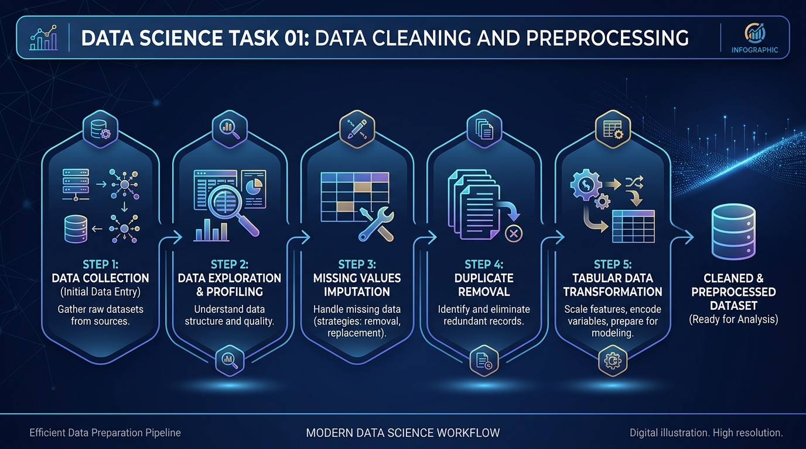

# IncodeVision Data Science Internship Tasks 🚀

This repository contains all 4 Data Science internship tasks assigned by IncodeVision.

---

## 📌 Tasks Overview

| Task | Title | Status | Folder / Description |
| :--- | :--- | :---: | :--- |
| **Task 01** | **Data Cleaning and Preprocessing** | ✅ Completed | [`task-01-datacleaning`](./task-01-datacleaning/) |
| **Task 02** | **Exploratory Data Analysis (EDA)** | ⏳ Upcoming | Summary statistics, visual patterns & correlations |
| **Task 03** | **Sales Prediction Model** | ⏳ Upcoming | Sales forecasting using regression techniques |
| **Task 04** | **Customer Segmentation Analysis** | ⏳ Upcoming | Customer clustering & segmentation |

---

## 🧹 Task 01: Data Cleaning and Preprocessing (Completed)

Created a complete automated pipeline, interactive Streamlit web application, and a step-by-step manual Jupyter notebook for cleaning raw tabular datasets.

- **Missing Values**: Imputed using Median (numerical) and Mode (categorical).
- **Duplicates**: Identified and removed redundant rows and duplicate IDs.
- **Format Normalization**: Standardized booleans, whitespaces, and numeric types.
- **Outliers**: Detected and treated using IQR (Interquartile Range) capping.
- **Files Included**:
  - `pipeline.py`: Reusable universal data cleaning pipeline engine.
  - `app.py`: Streamlit web app with custom file upload & live dashboard.
  - `task1_data_cleaning.ipynb`: Manual step-by-step Jupyter Notebook.
  - `cleaned_student_performance.csv`: Processed clean dataset output.

---

## 📊 Task 02: Exploratory Data Analysis (EDA)
*Upcoming — Analyzing distributions, bar charts, histograms, correlation plots, and extracting data insights.*

---

## 📈 Task 03: Sales Prediction Model
*Upcoming — Building regression models (Linear Regression, Decision Tree, Random Forest) to predict sales.*

---

## 👥 Task 04: Customer Segmentation Analysis
*Upcoming — Applying clustering algorithms (K-Means / Hierarchical) to group customers based on behavior & spending.*
